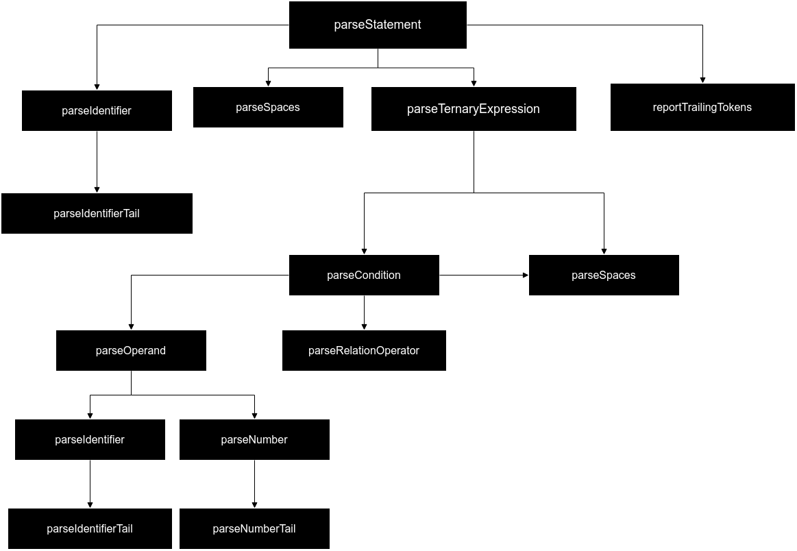
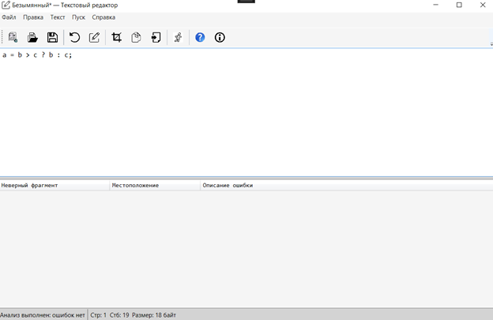

# Лабораторная работа №3. Разработка синтаксического анализатора (парсера)

## Цель работы
Изучить назначение и принципы работы синтаксического анализатора в структуре компилятора. Спроектировать грамматику, построить соответствующую схему метода анализа грамматики и выполнить программную реализацию парсера с нейтрализацией синтаксических ошибок методом Айронса. Интегрировать разработанный модуль в ранее созданный графический интерфейс языкового процессора.

## Автор
Геронимус Матвей Анатольевич  
Группа: АП-326

## Постановка задачи
Разработать синтаксический анализатор (парсер) в соответствии с индивидуальным вариантом РГЗ, интегрировать его в приложение из лабораторной работы №1 и обеспечить наглядный вывод результатов анализа.

### Требования к разработке парсера
- Разработать грамматику для заданной синтаксической конструкции.
- Построить схему метода анализа на основе разработанной грамматики.
- Выполнить программную реализацию алгоритма работы синтаксического анализа.
- Реализовать алгоритм нейтрализации синтаксических ошибок методом Айронса.

### Входные данные
Строка или многострочный текст программного кода из области редактирования.

### Выходные данные
- При успешном анализе корректной строки — сообщение об отсутствии ошибок.
- При обнаружении ошибок — таблица с описанием каждой ошибки.

## Вариант
**Тернарный оператор языка C++**

Пример конструкции:
```cpp
a = b > c ? b : c;
```

### Допустимые лексемы

| Лексема | Код |
|---|---:|
| Целое без знака | 1 |
| Идентификатор | 2 |
| Разделитель (пробел) | 3 |
| Оператор | 4 |
| Знак `?` | 5 |
| Знак `:` | 6 |
| Знак `;` | 7 |

### Допустимые операторы
- оператор присваивания: `=`
- операторы отношения: `>`, `<`, `>=`, `<=`, `==`, `!=`

### Примеры корректных строк
```cpp
a = b > c ? b : c;
x = n == 0 ? 1 : 2;
res = a != b ? 10 : 20;
```

## Разработка грамматики

Формально грамматика записывается в виде:

**G[Z] = (Vt, Vn, P, Z)**

### Множество терминальных символов
```text
Vt = { letter, digit, '_', whitespace, '=', '>', '<', '>=', '<=', '==', '!=', '?', ':', ';' }
```

### Множество нетерминальных символов
```text
Vn = { Z, <тернарное-выражение>, <условие>, <операнд>, <идентификатор>,
       <идентификатор-продолжение>, <число>, <число-продолжение>,
       <оператор-отношения>, <пробел> }
```

### Правила вывода
```text
1) Z -> <идентификатор> <пробел> '=' <пробел> <тернарное-выражение> ';'

2) <тернарное-выражение> -> <условие> <пробел> '?' <пробел> <операнд> <пробел> ':' <пробел> <операнд>

3) <условие> -> <операнд> <пробел> <оператор-отношения> <пробел> <операнд>

4) <операнд> -> <идентификатор> | <число>

5) <идентификатор> -> letter <идентификатор-продолжение>
                    | '_' <идентификатор-продолжение>

6) <идентификатор-продолжение> -> letter <идентификатор-продолжение>
                                | digit <идентификатор-продолжение>
                                | '_' <идентификатор-продолжение>
                                | e

7) <число> -> digit <число-продолжение>

8) <число-продолжение> -> digit <число-продолжение> | e

9) <оператор-отношения> -> '>' | '<' | '>=' | '<=' | '==' | '!='

10) <пробел> -> whitespace <пробел> | whitespace
```

## Классификация грамматики (по Хомскому)
Разработанная грамматика относится к **контекстно-свободным грамматикам**, то есть к **грамматикам 2 типа по классификации Хомского**.

Это объясняется тем, что каждое правило имеет вид:

```text
A -> α
```

где слева находится ровно один нетерминальный символ, а справа — произвольная последовательность терминалов и нетерминалов.

Следовательно, данная грамматика допускает построение синтаксического анализатора методом рекурсивного спуска.


## Метод анализа
Так как разработанная грамматика является контекстно-свободной, для синтаксического анализа используется **метод рекурсивного спуска**.

Основная идея метода рекурсивного спуска состоит в том, что каждому нетерминалу грамматики ставится в соответствие отдельная процедура синтаксического анализа. Эти процедуры вызываются в соответствии с правилами грамматики и последовательно распознают корректную цепочку лексем.

В программе реализованы следующие основные процедуры:
- `parseStatement`
- `parseTernaryExpression`
- `parseCondition`
- `parseOperand`
- `parseIdentifier`
- `parseIdentifierTail`
- `parseNumber`
- `parseNumberTail`
- `parseRelationOperator`
- `parseSpaces`
- `reportTrailingTokens`

Главной процедурой является `parseStatement`, которая соответствует начальному символу `Z` и анализирует конструкцию вида:

```cpp
идентификатор = условие ? операнд : операнд;
```

### Диаграмма рекурсивного спуска


## Диагностика и нейтрализация синтаксических ошибок
Для диагностики и нейтрализации синтаксических ошибок использован **метод Айронса**.

Основная идея метода заключается в том, чтобы при возникновении ошибки не прекращать анализ полностью, а восстановить разбор в ближайшей допустимой точке и продолжить анализ оставшегося текста.

В данной работе это реализовано следующим образом:
- сначала каждая строка передаётся в лексический анализатор;
- если в строке обнаружены лексические ошибки, они добавляются в итоговую таблицу, а синтаксический анализ этой строки не выполняется;
- если лексических ошибок нет, поток лексем передаётся в синтаксический анализатор;
- при возникновении синтаксической ошибки выполняется нейтрализация: анализатор фиксирует ошибку, пропускает фрагмент до конца текущего оператора и продолжает обработку следующей строки.

Такой подход позволяет:
- не останавливаться после первой ошибки;
- находить несколько ошибок за один запуск;
- сохранять устойчивость анализа даже при многострочном вводе.

## Интерфейс программы
Программа реализована в виде текстового редактора с графическим интерфейсом на WPF.

Функциональность интерфейса:
- ввод текста в область редактирования;
- запуск анализа по кнопке **Пуск**;
- сначала выполнение лексического анализа, затем синтаксического;
- вывод найденных ошибок в таблицу;
- отображение общего количества ошибок в строке статуса;
- переход к месту ошибки по щелчку на строке таблицы;
- подсветка ошибочного фрагмента в редакторе.

## Тестовые примеры

### Пример корректного ввода строки


### Пример некорректного ввода строки


### Пример многострочного ввода


## Вывод
В ходе выполнения лабораторной работы был разработан синтаксический анализатор для тернарного оператора языка C++. Была спроектирована формальная грамматика, построена схема метода анализа и реализован парсер методом рекурсивного спуска.

Также была реализована диагностика и нейтрализация синтаксических ошибок методом Айронса, что позволило находить несколько ошибок за один запуск и продолжать анализ после возникновения ошибки.

Разработанный синтаксический анализатор был успешно интегрирован в графический интерфейс приложения, созданного ранее, и обеспечивает удобное отображение результатов анализа и навигацию по найденным ошибкам.
